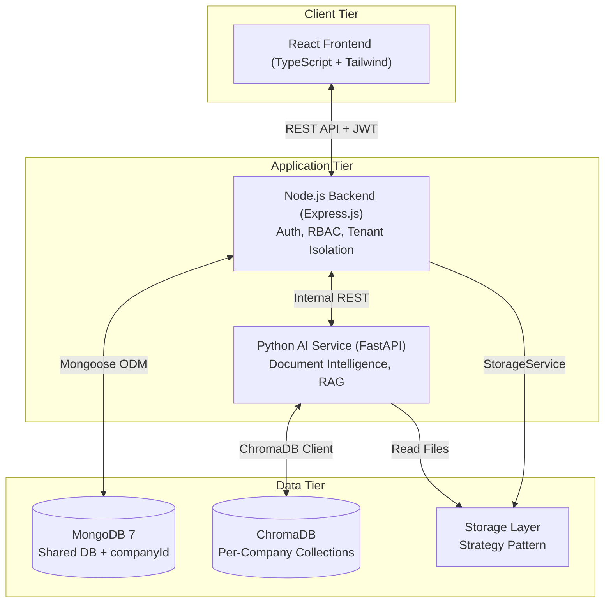
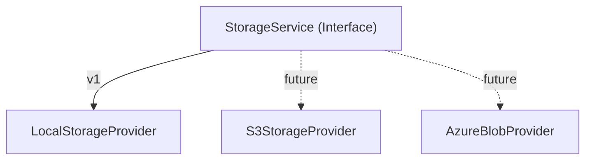

# Software Architecture

The Enterprise AI Knowledge Management Platform uses a **Modular Monolith + AI Microservice** architecture. This balances enterprise-grade separation of concerns with the simplicity needed for a final-year engineering project.

## High-Level Architecture



## Folder Structure

The repository is structured as a monorepo:

```
enterprise-knowledge-platform/
├── docker-compose.yml
├── .env.example
├── README.md
├── docs/                      # Technical documentation
├── frontend/                  # React UI
├── backend/                   # Node.js API
│   └── src/
│       ├── config/            # DB, env, storage config
│       ├── controllers/       # Request coordination
│       ├── middlewares/       # Auth, isolation
│       ├── models/            # Mongoose schemas
│       ├── providers/         # Storage strategy implementations
│       ├── repositories/      # Data access (companyId enforced)
│       ├── routes/            # Versioned routes (/api/v1)
│       ├── seeders/           # RBAC default seeders
│       ├── services/          # Business logic
│       ├── utils/             # Helpers
│       └── validators/        # Joi schemas
├── ai-service/                # Python FastAPI
│   └── src/
│       ├── api/               # API routes & Pydantic schemas
│       ├── classifiers/       # AI type & dept prediction
│       ├── config/            # Settings
│       ├── embeddings/        # Embedding generation
│       ├── extractors/        # Text extraction (Factory Pattern)
│       ├── llm/               # LLM clients
│       ├── memory/            # Chat history
│       ├── processors/        # Pipeline orchestrators
│       ├── prompts/           # Prompt templates
│       ├── retrievers/        # Vector search
│       ├── summarizers/       # Summary generation
│       ├── tagging/           # Tag generation
│       ├── utils/             # Cleaners, logging
│       └── vectorstore/       # ChromaDB client
└── storage/                   # Local file storage volume
```

## Multi-Tenant Architecture

The platform uses a **Shared Database, Shared Collection** strategy with strict `companyId` isolation.
- **MongoDB**: All tenants share the database, but every query mandates a `companyId` filter applied automatically by the `BaseRepository`.
- **ChromaDB**: Each company gets an isolated collection (`company_{companyId}`).
- **Storage**: Files are segregated into `storage/{companyId}/` directories.

## Storage Architecture

Document storage is decoupled from the local filesystem using the **Strategy Pattern**.



## Docker Architecture

The platform is fully containerized using Docker Compose:
- **frontend**: React Vite server (Port 5173).
- **backend**: Node.js Express server (Port 5000).
- **ai-service**: Python FastAPI server (Port 8000).
- **mongodb**: Persistent database storage.
- **chromadb**: Persistent vector storage.
All containers communicate over an internal Docker network, with proper health checks and restart policies.
