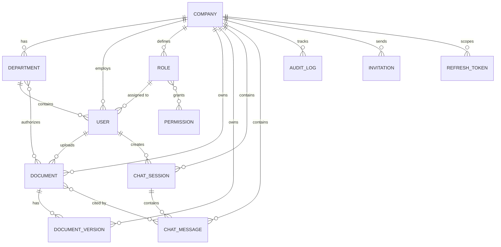

# Database Schema

The platform uses MongoDB 7 as its operational database. It is a shared-database, shared-collection multi-tenant system: every tenant-owned record carries a `companyId`. System permissions are global and default roles are the sole permitted exception, using `companyId: null`.

## Canonical Naming Rules

- Lifecycle state is stored in `status`, not `isActive` or `processingStatus`.
- Stored file locations use `storagePath`.
- Sensitive values are stored as hashes: `passwordHash`, `tokenHash`, and `invitationTokenHash`.
- Permission identifiers use `code` and the canonical format `<resource>:<action>` (for example, `documents:upload`).
- Chat messages use `role`, `content`, and `sources`.

## Collections (12 Total)

### 1. companies

Tenant identity and settings.

- `_id`, `name`, `slug`, `companyCode`, `email`, `address`, `logo`, `status`, `settings`
- `slug` is the canonical URL-safe tenant identifier.
- `companyCode` is retained as a useful human/business identifier for seeded and external references.
- `status`: `active`, `inactive`, or `suspended`.

### 2. departments

Company departments.

- `_id`, `companyId`, `name`, `description`, `status`, `createdBy`
- `status`: `active` or `inactive`.

### 3. permissions

Immutable, global permission definitions.

- `_id`, `code`, `displayName`, `description`, `module`, `action`
- `code` is the canonical, unique permission identifier.
- The older `name` field remains only as a compatibility mirror for data created before Phase 4.2; new code must use `code`.

### 4. roles

Tenant-defined roles and global default roles.

- `_id`, `companyId`, `name`, `description`, `permissionIds`, `status`
- `companyId: null` is reserved for global default roles.

### 5. users

Employee accounts and authentication data.

- `_id`, `companyId`, `roleId`, `departmentId`, `name`, `email`, `passwordHash`, `employeeId`, `status`, `profilePicture`

### 6. documents

Document metadata, AI suggestions, and review state.

- `_id`, `companyId`, `departmentIds`, `uploadedBy`, `filename`, `originalFilename`, `fileType`, `fileSize`, `storagePath`
- `sourceType`, `sourceId`, `classification`, `category`, `tags`, `summary`, `version`, `status`, `aiSuggestions`
- `status`: `pending`, `processing`, `pending_review`, `approved`, `rejected`, or `error`.
- `category`, `departmentIds`, `classification`, `tags`, and `summary` are administrator-approved metadata.
- `aiSuggestions` stores separate, pre-approval AI output: `category`, `departmentIds`, `classification`, `tags`, `summary`, and `generatedAt`.

### 7. documentVersions

Immutable version history for a document.

- `_id`, `companyId`, `documentId`, `version`, `uploadedBy`, `changes`, `storagePath`, `createdAt`

### 8. chatSessions

User chat threads.

- `_id`, `companyId`, `userId`, `title`, `messageCount`, `status`, `createdAt`, `updatedAt`

### 9. chatMessages

User and assistant messages with source citations.

- `_id`, `sessionId`, `companyId`, `userId`, `role`, `content`, `sources`, `timestamp`
- `role`: `user` or `assistant`.
- `sources`: `{ documentId, snippet, relevanceScore }[]`.
- Read/write compatibility aliases exist for the earlier `sender`, `message`, and `citedDocuments` model vocabulary; API and new service code use the canonical fields above.

### 10. auditLogs

Immutable compliance and security events.

- `_id`, `companyId`, `userId`, `action`, `resource`, `details`, `status`, `expiresAt`, `timestamp`
- `resource` identifies the affected resource type; `details` contains structured event context.
- The earlier `module`, `description`, and `metadata` fields remain optional compatibility fields. New code writes `resource` and `details`.

### 11. invitations

Employee onboarding invitations.

- `_id`, `companyId`, `roleId`, `departmentId`, `email`, `invitationTokenHash`, `expiresAt`, `status`, `invitedBy`

### 12. refreshTokens

Hashed refresh-token records for secure session management.

- `_id`, `companyId`, `userId`, `tokenHash`, `expiresAt`, `device`, `revoked`, `revokedAt`, `createdAt`

## Entity Relationship Diagram

## Index Strategy

- **Tenant queries**: Tenant-owned collections use compound indexes beginning with `companyId` where a tenant query is expected. This includes documents, document versions, users, departments, roles, invitations, refresh tokens, chat sessions, chat messages, and audit logs.
- **Unique indexes**:
  - `companies.slug`, `companies.companyCode`, and `companies.email`
  - `permissions.code`
  - `{ companyId, name }` for departments and roles
  - `{ companyId, email }` and sparse `{ companyId, employeeId }` for users
  - `{ companyId, documentId, version }` for document versions
- **TTL indexes**: `refreshTokens.expiresAt` and `invitations.expiresAt` expire at their recorded time. `auditLogs.expiresAt` has a TTL index but is optional, so audit retention remains explicit rather than being silently deleted.
- **Retrieval indexes**: Documents are indexed by tenant plus status, departments, classification, category, source type, and creation date. Chat and audit collections have tenant/time indexes for chronological retrieval.

## Tenant Scope Contract

At this database-foundation stage, `BaseRepository` accepts an optional trusted scope as the final argument to its CRUD methods. A future caller can pass `{ companyId }`, which overrides the same field in an untrusted filter or payload. Module 6 will supply that scope exclusively from verified identity and enforce it for every tenant-owned access. No request-provided company identifier is trusted.
