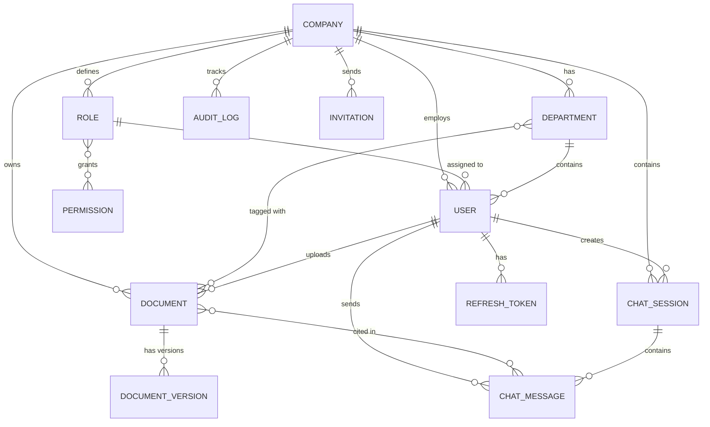

# Database Schema

The platform uses MongoDB 7 as its primary operational database. It implements a multi-tenant shared-database architecture, isolating data using the `companyId` field.

## Collections (12 Total)

### 1. companies
Stores tenant information, settings, and quotas.
- `_id`, `name`, `slug`, `email`, `settings`, `isActive`

### 2. departments
Dynamic departments per company.
- `_id`, `companyId`, `name`, `description`, `isActive`

### 3. permissions
System-defined permissions (immutable).
- `_id`, `code` (e.g., 'documents:upload'), `module`, `displayName`

### 4. roles
Dynamic roles mapping to permissions.
- `_id`, `companyId`, `name`, `permissions` (Array of ObjectIds)

### 5. users
Employee accounts and authentication data.
- `_id`, `companyId`, `roleId`, `departmentId`, `email`, `password`, `isActive`

### 6. documents
Document metadata, status, and AI suggestions.
- `_id`, `companyId`, `departmentIds`, `uploadedBy`, `filename`, `processingStatus`, `documentCategory`, `aiSuggestions`

### 7. documentVersions
Tracking document history and updates.
- `_id`, `documentId`, `companyId`, `version`, `filePath`

### 8. chatSessions
User chat threads.
- `_id`, `companyId`, `userId`, `title`, `messageCount`

### 9. chatMessages
AI and user messages with source citations.
- `_id`, `sessionId`, `companyId`, `role` ('user'|'assistant'), `content`, `sources`

### 10. auditLogs
Comprehensive tracking of all actions for compliance.
- `_id`, `companyId`, `userId`, `action`, `resource`, `details`

### 11. invitations
Employee onboarding and invites.
- `_id`, `companyId`, `roleId`, `departmentId`, `email`, `token`

### 12. refreshTokens
Secure session management.
- `_id`, `userId`, `companyId`, `token`, `expiresAt`, `isRevoked`

## Entity Relationship Diagram

## Index Strategy
- **Tenant Isolation**: Every collection has a compound index starting with `companyId` (e.g., `{ companyId: 1, email: 1 }`).
- **TTL Indexes**: `auditLogs`, `refreshTokens`, and `invitations` use TTL indexes for automatic expiration.
- **Unique Indexes**: `slug` and `email` on companies; `{ companyId, email }` on users.

## companyId Isolation Strategy
The isolation is enforced at the Data Access Layer (Repository). The `BaseRepository` class automatically prepends `{ companyId }` to every query (find, update, delete). The `companyId` is securely extracted from the validated JWT by the `tenantIsolation` middleware.
